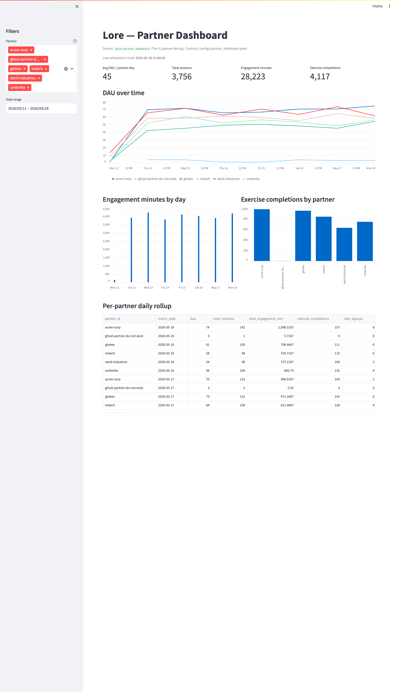
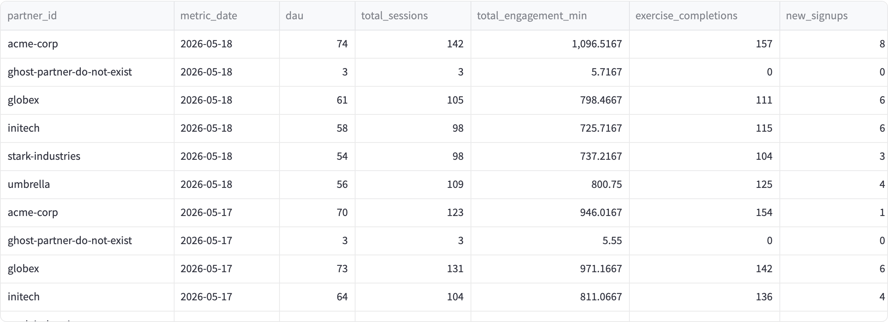

# Lore Health — Case Study 1: Strategic Data Pipeline Modernization

[](https://github.com/gollapally1/lore_case_study/actions/workflows/test.yml)
[](https://www.python.org/downloads/)
[](LICENSE)

**Author:** Naveen Gollapally
**Role:** Staff Data Engineer (Panel Round)
**Case:** Strategic Pipeline Modernization

> **Reviewer's quickstart:** the [TL;DR](#tldr) sets up the thesis; [the demo](#how-to-run-the-demo-live-30-sec) is one command; [docs/ARCHITECTURE.md](docs/ARCHITECTURE.md) has the future-state diagram; [docs/MIGRATION_PLAN.md](docs/MIGRATION_PLAN.md) has the phased plan. For a printable single-file artifact, see [Sharing this case study](#sharing-this-case-study) below.

---

## TL;DR

Lore's near-real-time partner dashboards are stitched together across multiple tools and clouds. That fragmentation isn't fundamentally a tooling problem; it's a **contract problem**. Every team ships its own pipeline because there's no shared definition of what "a user engagement event" or "a partner-level KPI" actually is.

My proposal: collapse the surface area to **one ingestion path, one storage layer, one transformation framework, three data products** — driven by versioned YAML data contracts that any squad can author without writing pipeline code.

The architecture is a Kafka-fronted, Delta-backed lakehouse with a Spark Structured Streaming + dbt-style batch transformation layer, serving a thin set of curated data products to a low-latency OLAP store (ClickHouse or Pinot) for the dashboards. The contract-driven framework is the same pattern I used to build NLPLyft at Wells Fargo, which cut ML pipeline delivery from 10 weeks to 4.

This repo contains:
- `docs/` — architecture, requirements, migration plan, talking points
- `configs/` — data contracts (YAML) for the 3 core data products
- `src/` — a runnable PySpark + Delta Lake prototype of the contract-driven framework
- `data/` — synthetic source data so the demo runs end-to-end
- `tests/` — a sample data quality check

---

## How to run the demo (live, ~30 sec)

```bash
pip install -r requirements.txt
bash demo.sh                  # all 4 steps + dashboard launch hint
# or run the steps individually:
python src/generate_sample_data.py
python src/run_pipeline.py --contract configs/engagement_events.yaml
python src/run_pipeline.py --contract configs/partner_dashboard.yaml
python src/run_pipeline.py --contract configs/user_journey.yaml
python src/query_results.py
streamlit run src/dashboard.py   # interactive partner dashboard
```

Each contract drives the full Bronze → Silver → Gold flow. Adding a fourth data product = write a YAML file, no pipeline code (see [docs/HOWTO_NEW_DATA_PRODUCT.md](docs/HOWTO_NEW_DATA_PRODUCT.md)).

Run the tests:
```bash
pytest tests/
```

---

## Screenshots

**Partner-facing Streamlit dashboard, reading directly from `gold.partner_dashboard`:**



**Per-partner daily rollup — the contractual numbers Lore reports to employer partners:**



---

## The three data products

| Product | Owner squad | Latency SLA | Consumer |
|---|---|---|---|
| `engagement_events` | Engagement squad | ≤ 2 min | Internal product analytics, ML feature store |
| `partner_dashboard` | Partner squad | ≤ 5 min | Employer-facing dashboards (the partner-visible product) |
| `user_journey` | Growth / Clinical squad | ≤ 15 min | Cohort analysis, retention, clinical outcomes |

All three are derived from the same Silver layer, which guarantees a partner dashboard and an internal analytics chart can never disagree on a number.

---

## How the response is organized

The case-study brief spans three concerns that are usually treated separately. The response addresses each substantively, not as a slide:

1. **Strategy** — phased migration, SLAs as the requirements artifact, where the org draws ownership lines. See [docs/MIGRATION_PLAN.md](docs/MIGRATION_PLAN.md) and [docs/REQUIREMENTS.md](docs/REQUIREMENTS.md).
2. **Engineering** — runnable code (contracts, runtime, tests, dashboard), explicit trade-offs (streaming engine, table format, exactly-once semantics, schema evolution, quarantine handling). See [src/](src/), [configs/](configs/), and [docs/TALKING_POINTS.md](docs/TALKING_POINTS.md) for the trade-off rationale.
3. **Collaboration** — how a non-DE squad ships a new data product without filing a ticket with the platform team. See [docs/HOWTO_NEW_DATA_PRODUCT.md](docs/HOWTO_NEW_DATA_PRODUCT.md).

[docs/TALKING_POINTS.md](docs/TALKING_POINTS.md) (renamed *Engineering Trade-offs & Operating Principles*) is the longest single doc — it captures the *why* behind each decision in the rest of the repo.

---

## Sharing this case study

This repo is the canonical artifact, but two derivative views make it easy to send via email.

**Single-file HTML/PDF.** Generate a polished one-pager that bundles every doc, ASCII output, and the Mermaid architecture diagram:

```bash
python scripts/build_case_study.py     # writes case_study.html (~50 KB)
open case_study.html                   # then File > Print > Save as PDF in Chrome
```

The HTML renders Mermaid and syntax highlighting via CDN; the same file prints cleanly to PDF in any modern browser — no pandoc / wkhtmltopdf toolchain needed.

**Demo recording.** The recommended walkthrough script is in [docs/DEMO_SCRIPT.md](docs/DEMO_SCRIPT.md): run `bash demo.sh`, open the Streamlit dashboard, narrate the rollup and the lineage sidecar. 3–4 minutes via [Loom](https://www.loom.com) is plenty.

**Repo layout:**
- [docs/](docs/) — architecture, requirements (with cost Fermi), migration plan, HOWTO, talking points, demo script
- [configs/](configs/) — data contracts (YAML); see also `engagement_events_v2_proposed.yaml` for the worked schema-versioning example
- [src/](src/) — runnable PySpark prototype: [run_pipeline.py](src/run_pipeline.py), [dashboard.py](src/dashboard.py), [check_schema_compat.py](src/check_schema_compat.py), [delete_user.py](src/delete_user.py), [query_results.py](src/query_results.py)
- [tests/](tests/) — 16 pytest tests (dedup, pseudonymization, schema enforcement, business invariants)
- [scripts/](scripts/) — `build_case_study.py` for the HTML/PDF artifact
- [.github/workflows/](.github/workflows/) — CI runs `pytest tests/` on every push
