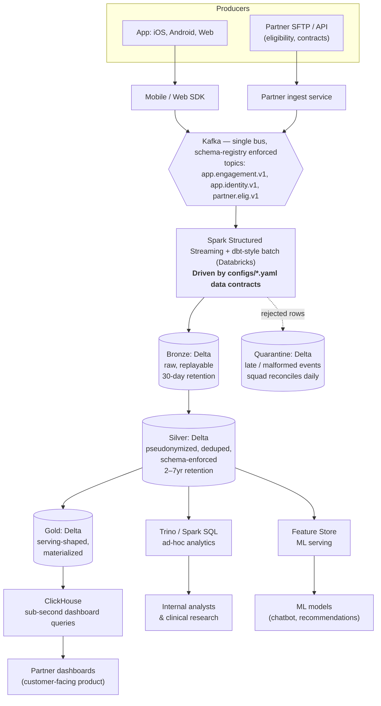

# Architecture: Current State → Future State

## Current state (assumed, based on the brief)

The brief describes a fragmented landscape — pipelines spread across multiple tools and cloud environments. From experience, this typically looks like:

- App events captured via mixed paths: Segment / Amplitude / Mixpanel + direct backend logging
- Some data in BigQuery, some in Snowflake, some in S3 + Athena
- Dashboards built on whatever was easiest at the time: Looker on top of BigQuery, internal React app on top of a Postgres replica, partner portal on top of a per-partner cached JSON
- Per-team ETL jobs in dbt, Airflow, and ad-hoc Lambdas, each interpreting "engagement" slightly differently
- No shared definition of `partner_id`, `session`, `active_user` — so dashboards drift

The cost is not the tools themselves; the cost is the **N²** problem of every team having to learn every system and reconcile every definition. New squad ships a new dashboard, the answer doesn't match an existing one, the partner asks why.

## Future state principles

1. **One source of truth per data product, owned by one squad.** No squad re-derives DAU; they consume the `partner_dashboard` data product. If they want a different definition, they fork the contract — explicitly.
2. **The contract is the API.** Producers and consumers agree on a versioned YAML; the platform team owns the runtime that honors it. Schema changes are PR-reviewed like any other API change.
3. **One ingestion path, one storage layer, one transformation framework.** Kafka → Spark Structured Streaming → Delta Lake. Anything that doesn't fit gets justified, not assumed.
4. **Bronze/Silver/Gold isn't decoration — it's the trust boundary.**
   - Bronze: raw, replayable, cheap, short retention
   - Silver: cleansed, deduped, schema-enforced, pseudonymized — this is the analytics-safe layer
   - Gold: serving-ready, materialized for the consumer's access pattern
5. **Latency tier follows the consumer, not the producer.** Partner dashboard = 5 min. Internal analytics = 15 min batch is fine. ML feature store = 2 min streaming. The pipeline framework supports both modes from the same source.
6. **PII has exactly one home.** Raw `user_id` lives in a separate PII vault with strict access. Silver/Gold see only the `sha256(salt + user_id)` pseudonym. Re-identification requires a deliberate join in a controlled environment.

## Future state architecture (one-screen overview)

## Why these choices

**Kafka over a managed event service (Segment, Pub/Sub).** Kafka is the only choice that gives us schema-registry-enforced contracts at the bus level, transparent multi-consumer fan-out, and replayability for backfills. A managed service is fine until the second team wants a different view of the same event — then you're paying twice and reconciling twice.

**Delta Lake on S3/ADLS.** ACID transactions, schema evolution, time travel for incident debugging, and a single format that Spark, Trino, and a future Flink job can all read. Iceberg is the close alternative; Delta wins on the Databricks ecosystem, including Unity Catalog for the governance layer.

**Spark Structured Streaming, not Flink, for v1.** Flink is technically superior for true sub-second streaming, but Lore's stated need is "near real-time" — 2-5 minute latency. Structured Streaming hits that with one runtime that also handles batch, which means one set of skills on the team. If we hit a use case that genuinely needs sub-second (e.g., real-time crisis intervention based on chat content), we add Flink for that one job, not for everything.

**ClickHouse for partner dashboards.** Partner-facing analytics queries are predictable shapes (group by partner_id + date, aggregate). ClickHouse beats every alternative on sub-second p95 at this query pattern. Pinot is the close competitor and is what Walmart uses; ClickHouse has the edge for OLAP query flexibility and is cheaper to operate at our scale.

**Unity Catalog for governance.** PII tagging, lineage, access controls all in one place. The contracts in `configs/*.yaml` feed the catalog directly — discovery and access policy are downstream of the same YAML.

## What this is NOT

- Not a data mesh. We have one platform team that owns the runtime; squads own the contracts and the consumers. The "mesh" rhetoric ships organizational dysfunction at our stage.
- Not multi-cloud. Pick one (Databricks on AWS or Azure, whichever Lore already commits to) and commit. Multi-cloud is a CYA architecture for companies that have already failed at single-cloud.
- Not a real-time streaming-first stack. Streaming where the consumer needs streaming; batch elsewhere. Same framework either way.
